# Models Overview

## EfficientNet
[arxiv link](https://arxiv.org/pdf/1905.11946v1.pdf)

Сутью данной сети является использование двух вещей:

1. Найденные по сетке оптимальные параметры глубины, ширины и разрешения изображения (`depth scaling`, `width scaling`, `resolution scaling`)
$$depth: d = \alpha^\psi$$
$$width: \omega = \beta^\psi$$
$$resolution: r = \gamma^\psi$$
$$s.t. \text{ } \text{ } \alpha \cdot \beta^2 \cdot \gamma^2 \approx 2$$
$$\alpha \geq 1, \text{ } \beta \geq 1, \text{ } \gamma \geq 1$$
Примечание: в B0 используется только базовый "блок"
2. Использование `MBConv` (Mobile Inverted Bottleneck) в качестве основного строительного блока. Данный блок был впервые обозначен в статье [MobileNetV2: Inverted Residuals and Linear Bottlenecks](https://arxiv.org/pdf/1801.04381.pdf). Основная отличие между Residual и Inverted Residual состоит в том, что классический Residual соединяет (SkipConn.) блоки с большим количеством каналов и использует больше нелинейности на входе и выходе из блока, а Inverted Residual, в свою очередь, соединяет узкие блоки (с меньшим количеством каналов). Это достигается благодаря использованию комбинации пространственных сверток.
3. Использование активации `Swish`. Данная функция была впервые обозначена в рамках исследования Google Brain [arxiv](https://arxiv.org/pdf/1710.05941.pdf). Суть исследования заключаласб в поиске альтернативы ReLU, который успел стать стандартом де-факто в глубинном обучении благодаря своей простоте, скорости вычисления и тому, что градиент на $[0, +\infty]$ не затухает. 

$$SWISH(x) = x * \sigma (x)$$


Благодаря этим подходам получилась быстрая, легкая и робастная архитектура. Я выбрал ее в качестве baseline для датасета [BIRDS 400 - SPECIES IMAGE CLASSIFICATION](https://www.kaggle.com/datasets/gpiosenka/100-bird-species).


## MobileNetV3
[Searching for MobileNetV3](https://arxiv.org/pdf/1905.02244.pdf)
1. Если судить глобально, и не брать во внимание к примеру квантитизацию, то эта архатектура отличается от базового блока EfficientNetB0 заключается в улучшенной версии блока базового блока. 
2. *MobileNetV3-Large is 3.2% more
accurate on ImageNet classification while reducing latency
by 20% compared to MobileNetV2. MobileNetV3-Small is
6.6% more accurate compared to a MobileNetV2 model
with comparable latency.*
3. Использование аппроксимации $SWISH$ с помощью замены $SIGMOID$ кусочно-гладким $RELU6$

$$h-swish(x) = x \cdot \frac{ReLU6(x+3)}{6}$$


----------


# Image Augmentations

Для аугментаций изображений я выборал известную библетотеку аугментаций [Albumentations](https://albumentations.ai), благодаря ее гибкости и скорости работы.

#### Augmentations Pipeline
1. `Random Rotate (limit=60)`
2. `Horizontal Flip(p=0.5)`
3. `ISO Noise(p=0.5)`
5. `Optical Distorsion(p=0.25)`
6. `Random Brightness Contrast(p=0.5)`
7. `CLAHE(p=0.25)`
8. `Channnel Shuffle(p=0.1)`
9. `Downscale(p=0.25)`
10. `FancyPCA(p=0.25)`
11. `Sharpen(p=0.25)`
12. `Coarse DropOut(p=0.25)`
13. `Resize`
14. `Normalize`

Хочу отметить, что такой широкий выбор аугментаций обусловлен тем, я не проводил глубокой аналитики датасета, а при более слабых аугментациях модель начинает переобучаться спустя несколько эпох.

## Normalization Params
Вместо того, чтобы взять дефолтные параметры нормализации из ImageNet, я написал скрипт для вычисления наиболее оптимальных параметров нормализации, он лежит в пути `birds-400/mean_std_util.py`. Получились следующие результаты:

$$ Color Mean: (0.4704, 0.4670, 0.3900) \quad vs. \quad (0.485, 0.456, 0.406)$$
$$ Color Std: (0.2390, 0.2328, 0.2543) \quad vs. \quad (0.229, 0.224, 0.225)$$

$$ Gray Mean: (0.4593, 0.4593, 0.4593), \quad Gray Std: (0.2269, 0.2269, 0.2269)$$


## Compose Examples
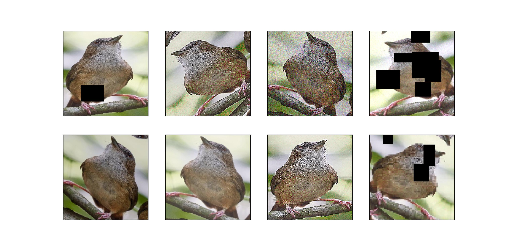


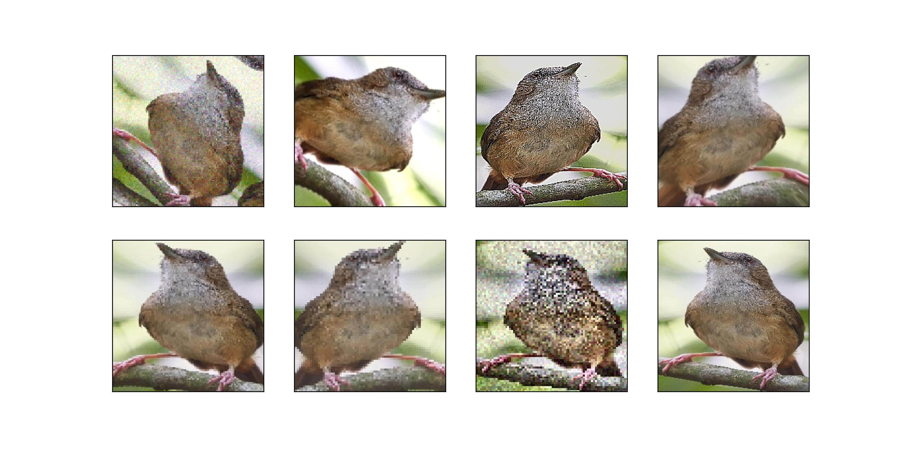


<!-- 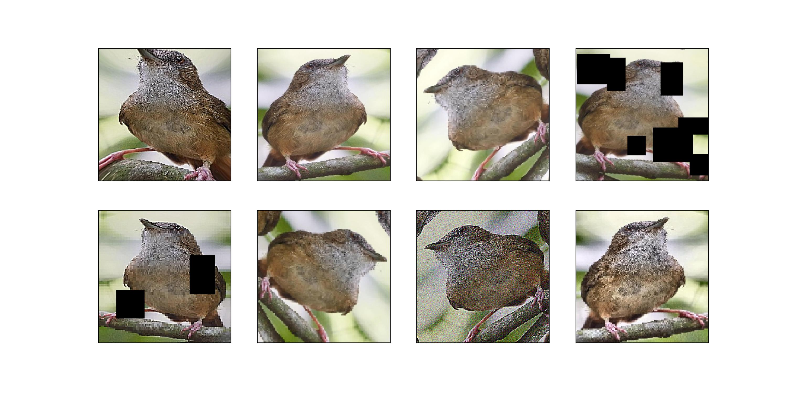 -->


<!-- 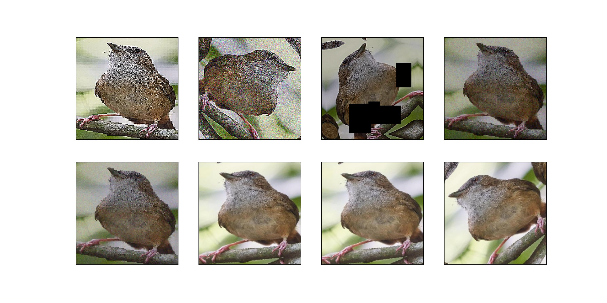 -->


<!-- 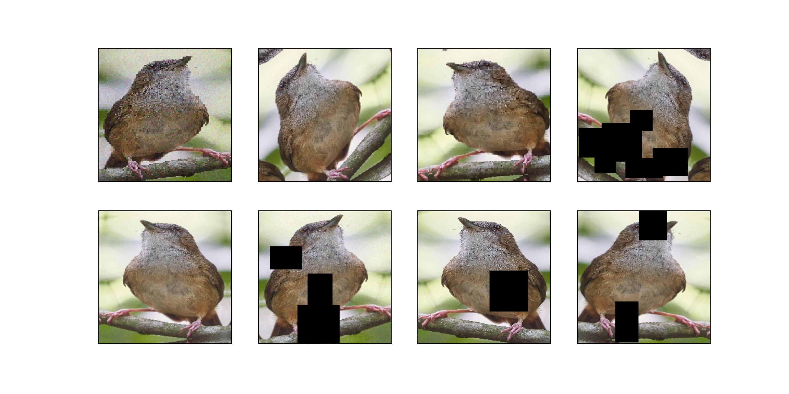 -->

---
# Training

P.S.
Все модели тренировались с одним и тем же фиксированным random seed, и более того -- во всех случаях использовалось одинаковое начальное приближение для LR

* Optimizer: `Adam`
* Initial LR: `3e-4`
* LR Scheduler: `ReduceLROnPlateau`
* Device SetUp: 
    * GPU: 1x 1080Ti
    * RAM: 64Gb
    * CPU: MD Ryzen Threadripper 1950X 16-Core Processor

Стурктура: каждая из трех представленнх моделей (EfficientNet, MobileNet-Large, MobileNet-small) училась в четырех конфигурациях:
* Цветные картинки:
    * Предобученная на ImageNet
    * Рандомно инициализированная
* Черно-белые картинки:
    * Предобученная на ImageNet
    * Рандомно инициализированная

---


# Results: Общая отсортированная сводная таблица

|  Net Name | Description  | Number of Parameters | Epochs  | Test Accuracy  | Test Loss  |
|---|---|---|---|---|---|
| EfficientNetB0  | Color from pretrained  |  4.5M | 19  | 97%  | 0.1  |
| MobileNetV3-Large  | Color from pretrained  | 3.5M  | 25  | 95%  | 0.2  |
|  EfficientNetB0 | Color from scratch  |  4.5M | 35  |  93% | 0.37  |
|  MobileNetV3-Small | Color from pretrained  |  1.5M |  18 |  91% | 0.44  |
| EfficientNetB0  | Gray from pretrained  | 4.5M   | 21 | 87%  | 0.48  |
| MobileNetV3-Large  | Gray from pretrained  | 3.5  | 19  | 77%  | 0.8  |
| MobileNetV3-Large  | Color from scratch  |  3.5M | 19  | 72%  |  1.1 |
| EfficientNetB0  | Gray from scratch  | 4.5  | 25  |  72% |  1.1 |
| MobileNetV3-Small  |  Gray from pretrained | 1.5M  | 19  | 58%  | 1.7  |
| MobileNetV3-Small  | Color from scratch  | 1.5M  |  23 | 57%  | 1.88  |
| MobileNetV3-Small  | Gray from scratch  | 1.5M |  27 | 40%  | 2.6  |
| MobileNetV3-Large  |  Gray from scratch |  3.5M | 26  | 28%  | 3.2  |


# Таблица по семействам

## EfficientnetB0

|  Net Name | Description  | Number of Parameters | Epochs  | Test Accuracy  | Test Loss  |
|---|---|---|---|---|---|
| EfficientNetB0  | Color from pretrained  |  4.5M | 19  | 97%  | 0.1  |
|  EfficientNetB0 | Color from scratch  |  4.5M | 35  |  93% | 0.37  |

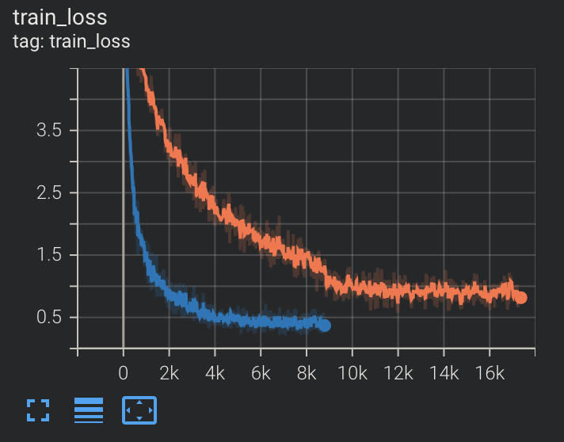
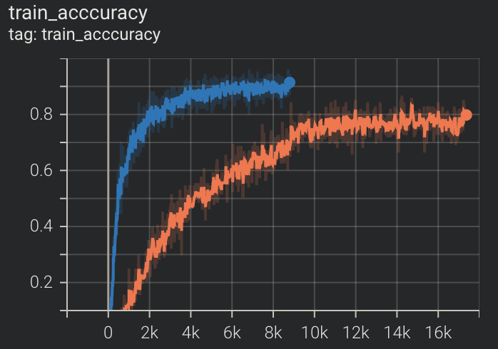


|  Net Name | Description  | Number of Parameters | Epochs  | Test Accuracy  | Test Loss  |
|---|---|---|---|---|---|
| EfficientNetB0  | Gray from pretrained  | 4.5M   | 21 | 87%  | 0.48  |
| EfficientNetB0  | Gray from scratch  | 4.5  | 25  |  72% |  1.1 |

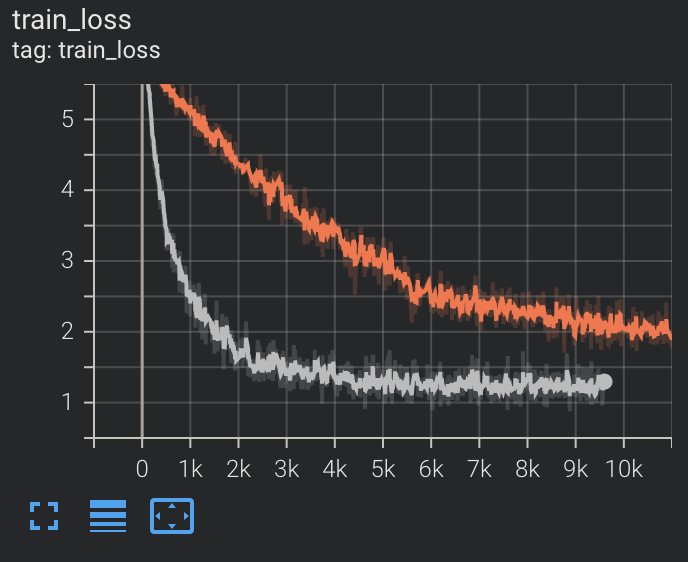
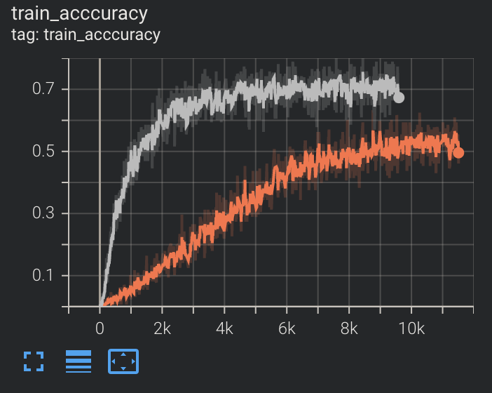


## MobileNetV3-Large

|  Net Name | Description  | Number of Parameters | Epochs  | Test Accuracy  | Test Loss  |
|---|---|---|---|---|---|
| MobileNetV3-Large  | Color from pretrained  | 3.5M  | 25  | 95%  | 0.2  |
| MobileNetV3-Large  | Color from scratch  |  3.5M | 19  | 72%  |  1.1 |

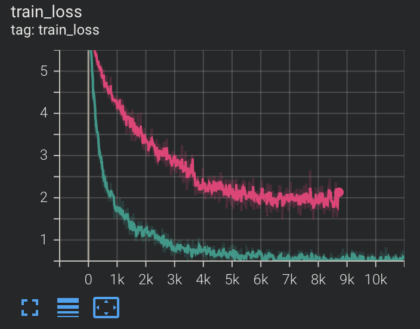
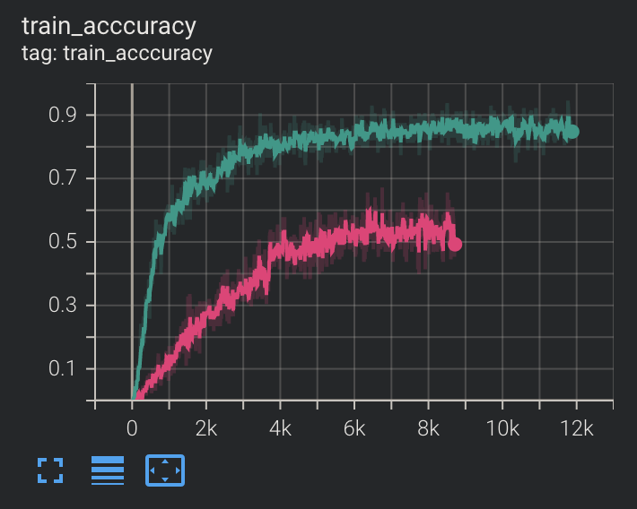


|  Net Name | Description  | Number of Parameters | Epochs  | Test Accuracy  | Test Loss  |
|---|---|---|---|---|---|
| MobileNetV3-Large  | Gray from pretrained  | 3.5  | 19  | 77%  | 0.8  |
| MobileNetV3-Large  |  Gray from scratch |  3.5M | 26  | 28%  | 3.2  |

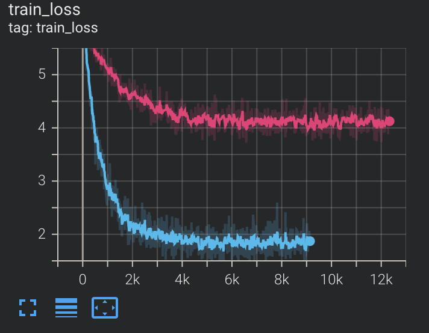
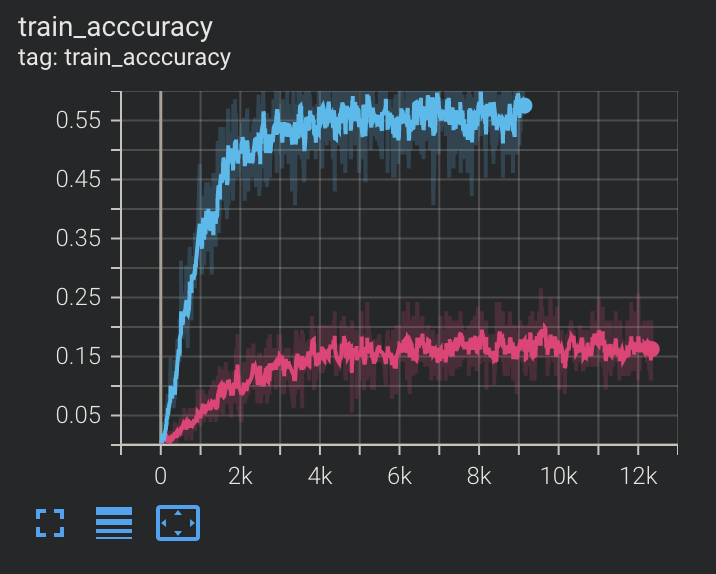


## MobileNetV3-Small

|  Net Name | Description  | Number of Parameters | Epochs  | Test Accuracy  | Test Loss  |
|---|---|---|---|---|---|
|  MobileNetV3-Small | Color from pretrained  |  1.5M |  18 |  91% | 0.44  |
| MobileNetV3-Small  | Color from scratch  | 1.5M  |  23 | 57%  | 1.88  |

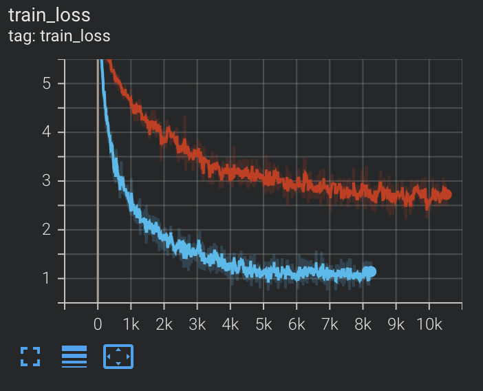
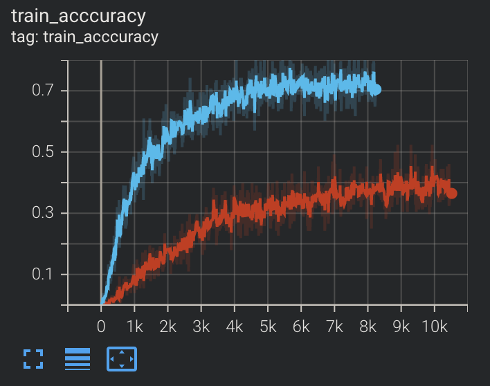


|  Net Name | Description  | Number of Parameters | Epochs  | Test Accuracy  | Test Loss  |
|---|---|---|---|---|---|
| MobileNetV3-Small  |  Gray from pretrained | 1.5M  | 19  | 58%  | 1.7  |
| MobileNetV3-Small  | Gray from scratch  | 1.5M |  27 | 40%  | 2.6  |

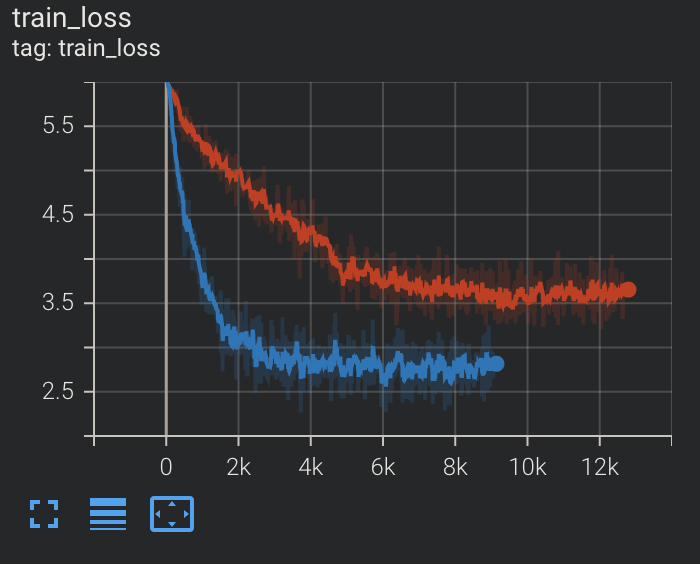
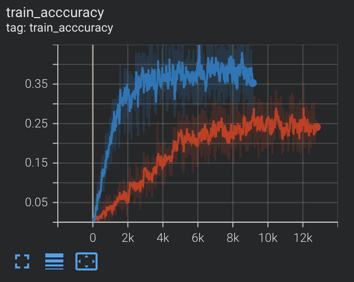


## Plots


```bash
$ python3 -m venv .birds-env
$ soure .birds-env/bin/activate
$ tensorboard --logdir=./lightning_logs --port=6006
```

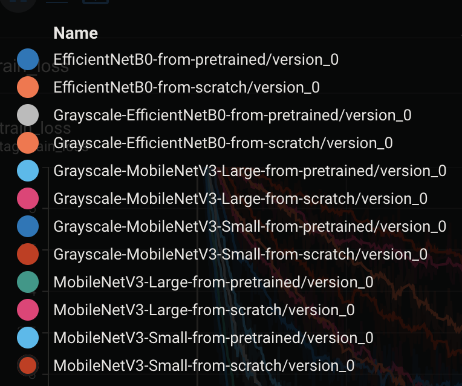
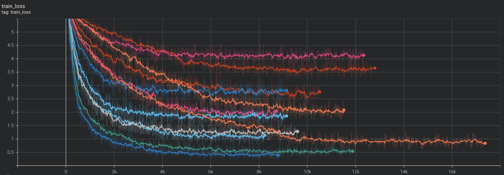
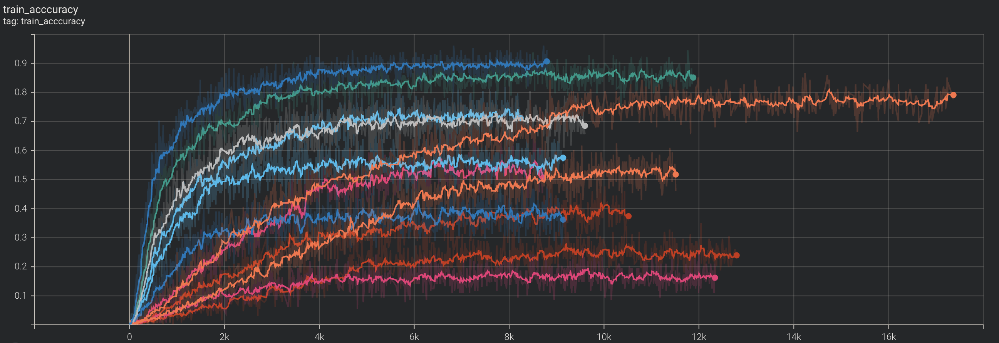
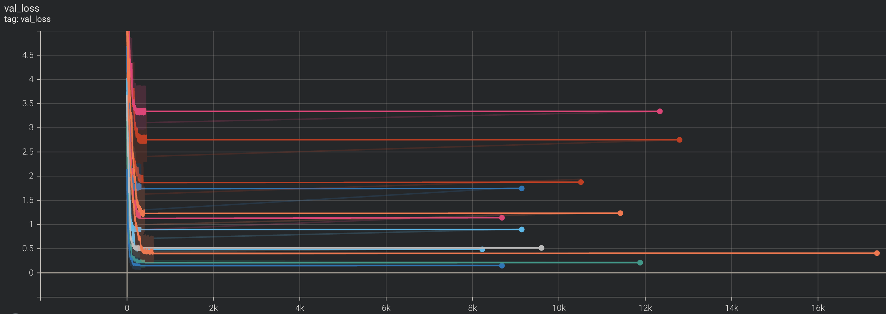
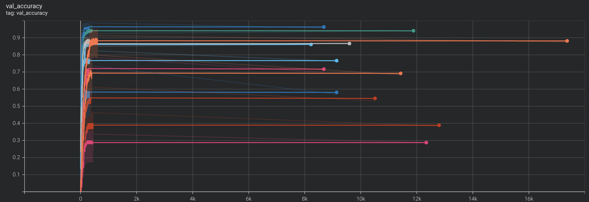


# Conclusions

Хочется отметить несколько (интересных и не очень) вещей
1. На страничке [датасета](https://www.kaggle.com/datasets/gpiosenka/100-bird-species) указывается, что модель EfficientNetB4 дала результат в 98% accuracy. Примечательным является то, что EfficientNetB0, будучи в 6 раз легче своего старшего брата, набрала уверенные 97+% accuracy.
2. Изначально было понятно, что модели, уже обученные на ImageNet, будут сходиться лучше. Но неочевидным моментом для меня стало разположение результатов серии моделей друг относительно друга (см общую сводную таблицу): некоторые модели, будучи заметно легче своих коллег, вырывались вперед по метрикам loss и accuracy
3. Появился один артефакт: MobileNetV3Large не справился с обучением на ЧБ фотографиях,  выйдя на плато после 4 тысяч шагов. Это может быть связано как и с неочевидной формой поверхности ошибки, так и просто с неудачным стечением обстоятельств. 